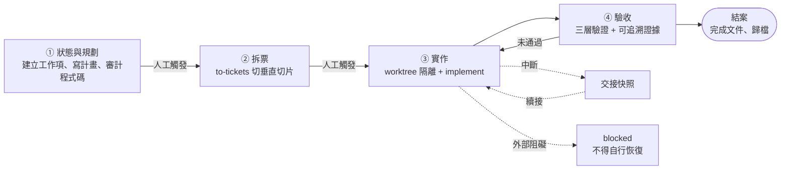

# Agent Harness

一套讓 AI coding agent 在**多個獨立 repo** 上開發時，產出**可控、可驗收、可交接**的流程規範。

> 本 repo 是從我實際使用中的 harness 抽象出來的版本：移除了所有產品、程式碼與環境細節，只保留流程核心與背後的設計取捨。

## 為什麼需要 harness

agent 寫程式很快，但放著不管時，常見的失敗幾乎都不是「不會寫」，而是：

- **宣稱完成，其實沒驗證**：測試沒跑、只在本機試過，或用一句「已驗證」帶過。
- **順手擴張範圍**：修 A 的時候順便重構了 B，review 與回滾都變困難。
- **session 一斷就失去脈絡**：下一個 session 不知道做到哪、卡在哪、下一步是什麼。
- **狀態散在多份文件互相矛盾**：計畫、進度紀錄、交接筆記各說各話。

harness 把這些失敗點變成**有規則、有機器檢查、有證據**的流程，並把幾個成本最高的決策點留給人。

## 流程總覽



## ① 狀態與規劃

所有工作集中在**一份狀態檔**，它是唯一的狀態來源；計畫、進度紀錄、交接筆記都只記脈絡，不能表達狀態。

- 每筆工作項必須寫清楚**完成條件**、**刻意不做的範圍**，以及**唯一的下一步**。
- 一支**無第三方依賴的驗證腳本**強制狀態不變式（欄位完整、路徑存在、進行中的工作都有對應 worktree……），違反時非零結束並指出是哪筆工作、哪條規則。
- 複雜需求先寫計畫，**動工前對照實際程式碼審計一輪**，逐項標出位置；計畫與程式碼衝突時以程式碼為準。

→ 詳見 [`docs/01-state-and-planning.md`](docs/01-state-and-planning.md)

## ② 拆票

用 [`to-tickets`](https://github.com/mattpocock/skills/blob/main/skills/engineering/to-tickets/SKILL.md) 把計畫切成**垂直切片（tracer bullet）**。

- 每張票貫穿需要的每一層、**能獨立展示或驗證**、在一個 context window 內做得完。
- 每張票標出 `Blocked by`，編號即相依順序。
- 切法（粒度、相依、要不要合併或拆開）經我確認才發布。

→ 詳見 [`docs/02-ticketing.md`](docs/02-ticketing.md)

## ③ 實作

每個工作項在每個涉及的 repo 開**一棵獨立 worktree 與分支**，由我手動啟動 [`implement`](https://github.com/mattpocock/skills/blob/main/skills/engineering/implement/SKILL.md)：

1. 在事先約定的邊界（seams）用 TDD 開發，期間頻繁跑型別檢查與單檔測試。
2. 結束時跑完整測試。
3. 經過 code review（專案規範、票的需求兩個面向）才 commit。

**拆票與實作兩個關卡刻意不讓 agent 自己觸發**：agent 把準備做到位後停下，按下開始的是人。

→ 詳見 [`docs/03-implementation.md`](docs/03-implementation.md)

## ④ 驗收

驗證分三層，缺一不可：


| 層         | 內容                                                                           |
| ---------- | ------------------------------------------------------------------------------ |
| 靜態與單元 | 各 repo 的預設 gate；改動前先跑 baseline，既有失敗點名、不混入本次結果         |
| 部署後環境 | 部署到測試環境後，**對部署後的服務**驗證；不得以本機分支程式碼連線測試環境代替 |
| 實機       | 行為變更在實機驗證；模擬器只能驗畫面                                           |

每項證據都要能指到 **log 行、資料列、截圖或 commit**，不接受一句「已驗證」；不適用的項目明確記為 skipped 並寫原因。全部通過、分支合併、完成文件寫好，工作項才能結案。

→ 詳見 [`docs/04-verification.md`](docs/04-verification.md)、[`docs/definition-of-done.md`](docs/definition-of-done.md)

## 支撐機制

四段流程之外，下列規範讓流程在長時間、多 session 下仍然成立：


| 文件                                                          | 解決什麼問題                                                                   |
| ------------------------------------------------------------- | ------------------------------------------------------------------------------ |
| [`definition-of-done.md`](docs/definition-of-done.md)         | 「程式改完」不等於「工作完成」：結案的七個條件                                 |
| [`evaluator-rubric.md`](docs/evaluator-rubric.md)             | 里程碑驗收：六面向 0–2 分，Accept／Revise／Block；產出的 agent 不能當唯一評審 |
| [`handoff-and-cleanup.md`](docs/handoff-and-cleanup.md)       | 中斷交接、blocked 規則、每次收尾的清單                                         |
| [`environment-boundaries.md`](docs/environment-boundaries.md) | Production 預設唯讀，寫入只能依有到期日的具名授權                              |
| [`design-decisions.md`](docs/design-decisions.md)             | 每條規則背後的「為什麼」與付出的代價                                           |

## Repo 結構

```text
agent-harness/
├── README.md                      本頁
├── AGENTS.md                      給 agent 讀的入口：不可違反的規則與路由表
├── init.sh                        驗證入口：範例狀態檢查 + 文件連結檢查
├── docs/
│   ├── 01-state-and-planning.md   ① 狀態與規劃
│   ├── 02-ticketing.md            ② 拆票
│   ├── 03-implementation.md       ③ 實作
│   ├── 04-verification.md         ④ 驗收
│   ├── definition-of-done.md      結案條件
│   ├── evaluator-rubric.md        里程碑評分表
│   ├── handoff-and-cleanup.md     交接與收尾
│   ├── environment-boundaries.md  環境與權限邊界
│   └── design-decisions.md        設計取捨
├── scripts/
│   ├── validate-state.mjs         一致性驗證器：規則表 19 條不變式的參考實作
│   └── check-links.mjs            文件內部連結檢查
└── templates/                     狀態檔、計畫、票、完成文件等範本
```

## 致謝

harness 的概念框架來自 [walkinglabs/learn-harness-engineering](https://github.com/walkinglabs/learn-harness-engineering)：把 agent 的可靠性拆成**指令、狀態、驗證、範圍、生命週期**五個子系統。本 repo 的四段流程與支撐機制就是照這個骨架長出來的。

拆票與實作使用 [mattpocock/skills](https://github.com/mattpocock/skills) 的 engineering skills。本 repo 的貢獻在於把這些 skill 放進一套有狀態模型、驗證規則與交接機制的完整流程。
